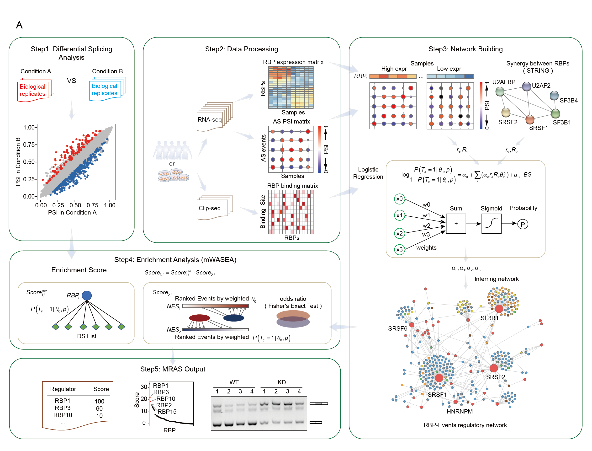

<!-- README.md is generated from README.Rmd. Please edit that file -->

```{r, include = FALSE}
knitr::opts_chunk$set(
  collapse = TRUE,
  comment = "#>",
  fig.path = "man/figures/README-",
  out.width = "80%"
)
```
# MRAS

<!-- badges: start -->
<!-- badges: end -->

MRAS is designed to identify crucial RNA-binding proteins (RBPs) responsible for splicing variations in diverse scenarios, including cancer vs. normal, primary vs. recurrence, and more, not just in bulk data but also in single-cell data.


## The Overview of MRAS



## Installation and Library

You can install the development version of MRAS from [GitHub](https://github.com/) with:

``` r
# install.packages("devtools")
devtools::install_github("zhou-lei5/MRAS")
library(MRAS)
```

## Usage and Examples
The easiest way to use MRAS: directly use the function `MRAS()`. The specific parameters are detailed in `??MRAS` or `help(MRAS)`.
There are some basic descriptions which shows you how to use MRAS:

### The basic code of input type 1
Input type 1: Direct input of the set of alternative splicing events.
Firstly, you need to download the pre-constructed regulation network generated by MRAS.In general, you will get two matrix: "rbp_event_deal_all_total" and "rbp_event_deal_all".
```r
MRAS(input_type = "1",
     expr,psi,
     rbp_interested,
     m,n,
     DS_pvalue,DS_dPSI,
     rbp_event_deal_all_total,rbp_event_deal_all,
     result_type,threads,path_use)

```
### The basic code of input type 2
Input type 2: Reconstruct the network using inferred relationships.
Firstly, you need to download the inferred relationships generated by MRAS. In general, yo will get one matrix: "rbp_net_mat_group".

```r
MRAS(input_type = "2",
     expr,psi,
     rbp_interested,
     m,n,
     DS_pvalue,DS_dPSI,
     rbp_net_mat_group,group,
     result_type,threads,path_use)

```
### The basic code of input type 3
Input type 3: Construct a network using the user's own data.
Here, we have prepared some test data for users to better understand the usage of MRAS.
Test data is included in MRAS and you can import it using data(), which contains the RBP expression matrix as well as the event PSI matrix.

Use MRAS in bulk rna-seq data:
```{r self-built network: hcc_expr }
## "hcc_expr" is RBP expression matrix.
library(MRAS)
data("hcc_expr")
hcc_expr[1:5,1:5]
```
```{r self-built network: hcc_psi}
## "hcc_psi" is events psi matrix."hcc_expr" and "hcc_psi" should have same column names.
data("hcc_psi")
hcc_psi[1:5,1:3]
```


<!-- # ```{r MRAS_BULK} -->
```r
## Users can utilize the MRAS function for a streamlined analysis, or execute individual steps separately if they prefer to have more control over specific aspects of the analysis.
result_bulk<-MRAS(input_type = "3",
  expr = hcc_expr,
  psi = hcc_psi,
  rbp_interested = "SF3B4",
  m = 50, n = 50,
  DS_pvalue = 0.05, DS_dPSI = 0.1,
  method =  "spearman",
  num1 = 0.15, num2 = 0.15,
  BS = NULL, smooth = F,
  dpsi_network_threshold = 0.1, Regulate_threshold = 0.5,
  group = T,
  result_type = "Top10", threads = 6, path_use = "./tests/"
)
result_bulk
```


After running `MRAS()`, there are three ways to display the results. In addition to setting the form directly in the parameters, users can also obtain other result display forms through the functions `get_Top10()`, `get_tab_all()`, and `get_tab_simple()`. This allows users to access additional result display formats without having to rerun `MRAS()`.

 <!-- ```{r MRAS_result} -->
```r
result_Top10<-get_Top10(path_use = "./tests/")
result_tab_simple<-get_tab_simple(path_use = "./tests/")
result_tab_all<-get_tab_all(path_use = "./tests/")
head(result_tab_simple[1:5,])
```


Use MRAS in bulk rna-seq data:

<!-- # ```{r MRAS_sc} -->
```r
data("sc_brca_expr")
data("sc_brca_psi")
result_sc<-MRAS(input_type = "3",
  expr = sc_brca_expr,
  psi = sc_brca_psi,
  rbp_interested = "ESRP1",
  m = 198, n = 317,
  DS_pvalue = 0.05, DS_dPSI = 0.1,
  method =  "spearman",
  num1 = 0.1, num2 = 0.1,
  BS = NULL, smooth = F,
  dpsi_network_threshold = 0.1, Regulate_threshold = 0.5,
  group = T, sc = T,
  result_type = "Top10", threads = 6, path_use = "./tests/"
)
result_sc
```
## Tools: AS Events ID converter
MRAS provides an ID converter specifically designed for splice events. This converter facilitates the matching of splice event coordinates obtained from different software, allowing seamless integration with the pre-constructed regulatory network generated by MRAS. This functionality simplifies the process of mapping splice events to the existing regulatory network, increasing the usability and versatility of MRAS.

AS Events ID Format: Gene Symbol_AS Type_Chromosome_Chain_AS Events Coordinates


MRAS provides the following features for ID conversion of splice events:

1. "id_find: This function allows the user to input the output path of commonly used splicing event identification software such as rMATS, SUPPA, and JUM. MRAS will directly return the PSI matrix or canonical splice event ID associated with the input data. This allows for seamless integration into the MRAS pre-built regulatory network.

2. "id_normalization": This function guides the user step-by-step through the input of the corresponding column coordinates, allowing for the standardized output of splicing event IDs. The process ensures consistency and compatibility in the representation of splicing events.

3. "id_change: This function converts splicing event IDs recognized by two different splicing event identification software. By default, a mismatch coordinate difference of 2 is used to account for potential differences in coordinate systems between the software. This allows users to bridge the gap between different software outputs and harmonize the representation of splicing events.
You can get help by  `??MRAS::FUN` or `help("FUN")`.

## Help
Of course, you can also distribute the MRAS analysis, which will help you better understand the principles of MRAS.

Finally, if you have any more questions, you can submit them in Github and we will do our best to answer them (https://github.com/zhou-lei5/MRAS).
