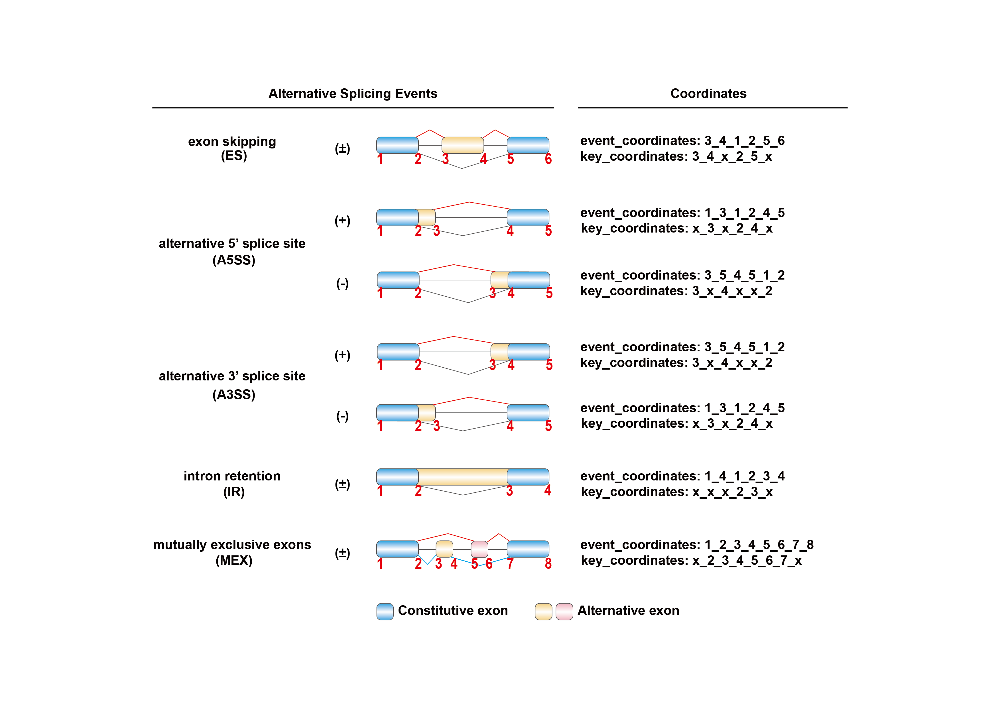

<!-- README.md is generated from README.Rmd. Please edit that file -->

```{r, include = FALSE}
knitr::opts_chunk$set(
  collapse = TRUE,
  comment = "#>",
  fig.path = "man/figures/README-",
  out.width = "80%"
)
```
# MRAS

<!-- badges: start -->
<!-- badges: end -->

MRAS (Master Regulator analysis of Alternative Splicing) is designed to identify the critical splicing factors whose altered expression drives the extensive splicing abnormalities, particularly in the biological scenario of lacking spliceosomal mutations or other known manipulations causing splicing disorders.


## The Overview of MRAS


## Installation and Library

You can install the development version of MRAS from [GitHub](https://github.com/) with:

``` r
# install.packages("devtools")
devtools::install_github("zhou-lei5/MRAS")
library(MRAS)
```

## Usage and Examples
The easiest way to use MRAS: directly use the function `MRAS()`. The specific parameters are detailed in `??MRAS` or `help(MRAS)`.

In summary, MRAS provides users with multiple input options to facilitate the analysis of alternative splicing regulation. Users can choose between the following options:

1) Direct input of the set of alternative splicing events: Users can provide a set of differential splicing events and map them onto the pre-constructed regulatory network generated by MRAS. This allows the identification of key RBPs involved in the regulation of these specific splicing events.

2) Reconstruct the network using inferred relationships: Users can combine the inferred relationships between RBPs and splicing events obtained from MRAS with their own data. This approach allows the integration of user-specific information into the MRAS network, potentially revealing additional regulatory relationships.

3) Construct a network using the user's own data: If the sample size is sufficient, users have the option of constructing their own regulatory network using their own data. MRAS can use this user-provided data to infer the relationships between RBPs and splicing events, providing a customized analysis based on the specific experimental conditions.

By providing these multiple input options, MRAS allows users to explore alternative splicing regulations from different perspectives, allowing for flexibility and customization in the analysis process.

(The event coordinates in the networks and relationships inferred by MRAS used the GRCh37 (hg19) coordinates.)

There are some basic descriptions which shows you how to use MRAS:

### The basic code of input type 1
Input type 1: Direct input of the set of alternative splicing events.

Firstly, you need to download the pre-constructed regulation network generated by MRAS.In general, you will get two matrix: "rbp_event_deal_all_total" and "rbp_event_deal_all".
```r
MRAS(input_type = "1",
     expr,psi,
     rbp_interested,
     m,n,
     rbp_event_deal_all_total,rbp_event_deal_all,
     result_type,threads,path_use)

```
### The basic code of input type 2
Input type 3: Construct a network using the user's own data.

Here, we have prepared some test data for users to better understand the usage of MRAS.
Test data is included in MRAS and you can import it using data(), which contains the RBP expression matrix as well as the event PSI matrix.

#### BULK RNA-seq
Use MRAS in bulk rna-seq data:
```{r self-built network: hcc_expr }
## "hcc_expr" is RBP expression matrix.
library(MRAS)
data("hcc_expr")
hcc_expr[1:5,1:5]
```
```{r self-built network: hcc_psi}
## "hcc_psi" is events psi matrix."hcc_expr" and "hcc_psi" should have same column names.
data("hcc_psi")
hcc_psi[1:5,1:3]
```


```{r MRAS_BULK}
## Users can utilize the MRAS function for a streamlined analysis, or execute individual steps separately if they prefer to have more control over specific aspects of the analysis.
result_bulk<-MRAS(input_type = "2",
  expr = hcc_expr,
  psi = hcc_psi,
  rbp_interested = "SF3B4",
  m = 50, n = 50,
  num1 = 0.15, num2 = 0.15,
  result_type = "Top10", threads = 6, path_use = "./tests/"
)
result_bulk
```


#### Single-cell RNA-seq
Use MRAS in single-cell rna-seq data:

```{r MRAS_sc}
data("sc_brca_expr")
data("sc_brca_psi")
result_sc<-MRAS(input_type = "2",
  expr = sc_brca_expr,
  psi = sc_brca_psi,
  rbp_interested = "ESRP1",
  m = 198, n = 317,
  sc = T,
  result_type = "Top10", threads = 6, path_use = "./tests/"
)
result_sc
```

### Type of MRAS result

After running `MRAS()`, there are three ways to display the results. In addition to setting the form directly in the parameters, users can also obtain other result display forms through the functions `get_Top10()`, `get_tab_all()`, and `get_tab_simple()`. This allows users to access additional result display formats without having to rerun `MRAS()`.


```{r MRAS_result}
result_Top10<-get_Top10(path_use = "./tests/")
result_tab_simple<-get_tab_simple(path_use = "./tests/")
result_tab_all<-get_tab_all(path_use = "./tests/")
head(result_tab_simple[1:5,])
```


### Interacting RBPs and co-regulated splicing events

```r
# get interacting RBPs。
`get_group(rbp_interested)`

# get splicing events co-regulated by interacting RBPs.
`get_group_events(rbp_interested,rbp_event_deal_all)`

```


## Tools: AS Events ID Converter
MRAS provides an ID converter specifically designed for splice events. This converter facilitates the matching of splice event coordinates obtained from different software, allowing seamless integration with the pre-constructed regulatory network generated by MRAS. This functionality simplifies the process of mapping splice events to the existing regulatory network, increasing the usability and versatility of MRAS.

AS Events ID Format: `Gene Symbol_AS Type_Chromosome_Chain_AS Events Coordinates`





MRAS provides the following functions for ID conversion of splice events:

### `id_find()`

This function allows the user to input the output path of commonly used splicing event identification software such as rMATS, SUPPA, and JUM. MRAS will directly return the PSI matrix or canonical splice event ID associated with the input data. This allows for seamless integration into the MRAS pre-built regulatory network.

### `id_normalization()`

This function guides the user step-by-step through the input of the corresponding column coordinates, allowing for the standardized output of splicing event IDs. The process ensures consistency and compatibility in the representation of splicing events.

### `id_change()`

This function converts splicing event IDs recognized by two different splicing event identification software. By default, a mismatch coordinate difference of 2bp is used to account for potential differences in coordinate systems between the software. This allows users to bridge the gap between different software outputs and harmonize the representation of splicing events.

If you want to know more details, you can get help by  `??MRAS::FUN` or `help("FUN")`.

## Help
If you have any more questions, you can submit them in Github and we will do our best to answer them (https://github.com/zhou-lei5/MRAS).
