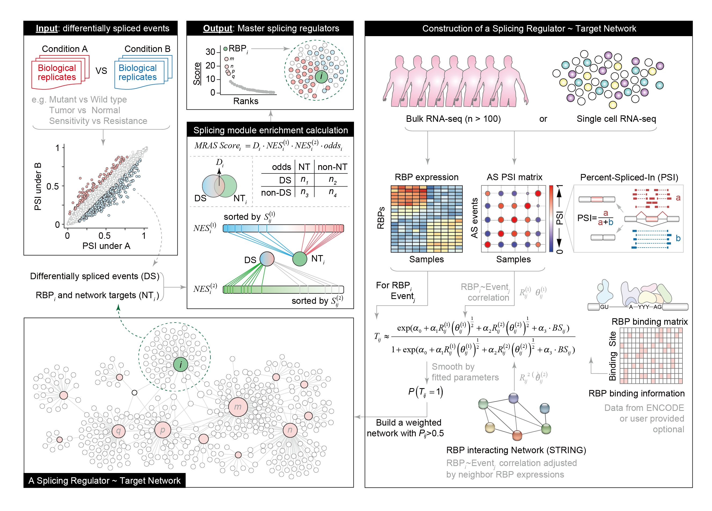
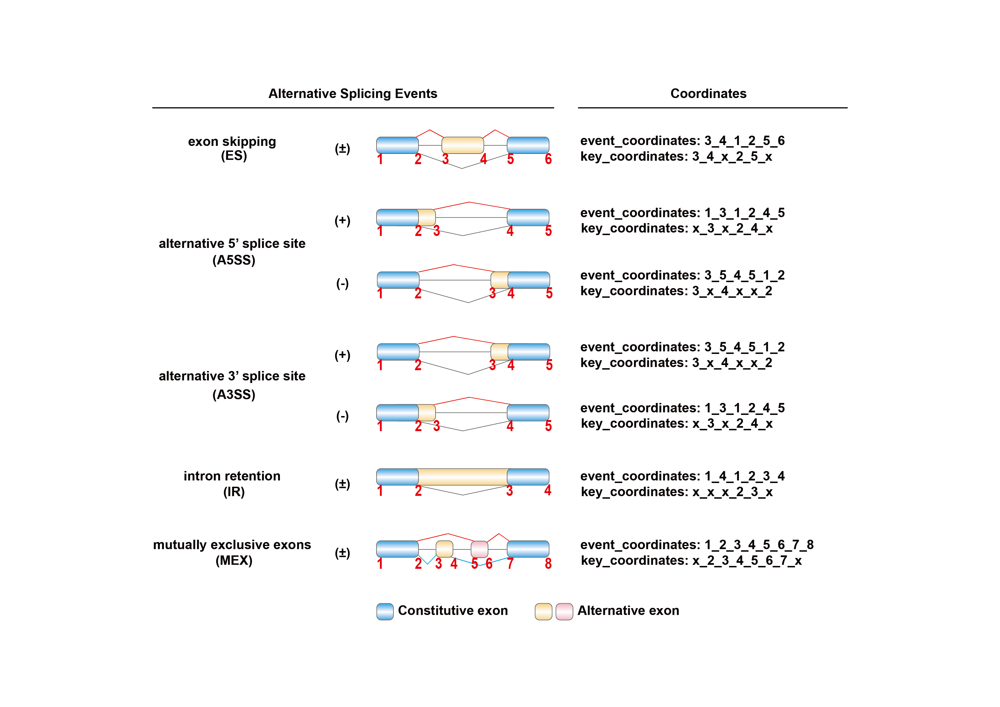

Menu
================

- [MRAS](#mras)
  - [The Overview of MRAS](#the-overview-of-mras)
  - [Installation and Library](#installation-and-library)
  - [Usage and Examples](#usage-and-examples)
    - [The basic code of input type 1](#the-basic-code-of-input-type-1)
    - [The basic code of input type 2](#the-basic-code-of-input-type-2)
      - [BULK RNA-seq](#bulk-rna-seq)
      - [Single-cell RNA-seq](#single-cell-rna-seq)
    - [Type of MRAS result](#type-of-mras-result)
    - [Interacting RBPs and co-regulated splicing
      events](#interacting-rbps-and-co-regulated-splicing-events)
  - [Tools: AS Events ID Converter](#tools-as-events-id-converter)
    - [`id_find()`](#id_find)
    - [`id_normalization()`](#id_normalization)
    - [`id_change()`](#id_change)
  - [Help](#help)

<!-- README.md is generated from README.Rmd. Please edit that file -->

# MRAS

<!-- badges: start -->
<!-- badges: end -->

MRAS is designed to identify crucial RNA-binding proteins (RBPs)
responsible for splicing variations in diverse scenarios, including
cancer vs. normal, primary vs. recurrence, and more, not just in bulk
data but also in single-cell data.

## The Overview of MRAS

<figure>

<figcaption aria-hidden="true">The Overview of MRAS</figcaption>
</figure>

## Installation and Library

You can install the development version of MRAS from
[GitHub](https://github.com/) with:

``` r
# install.packages("devtools")
devtools::install_github("zhou-lei5/MRAS")
library(MRAS)
```

## Usage and Examples

The easiest way to use MRAS: directly use the function `MRAS()`. The
specific parameters are detailed in `??MRAS` or `help(MRAS)`.

In summary, MRAS provides users with multiple input options to
facilitate the analysis of alternative splicing regulation. Users can
choose between the following options:

1)  Direct input of the set of alternative splicing events: Users can
    provide a set of differential splicing events and map them onto the
    pre-constructed regulatory network generated by MRAS. This allows
    the identification of key RBPs involved in the regulation of these
    specific splicing events.

2)  Reconstruct the network using inferred relationships: Users can
    combine the inferred relationships between RBPs and splicing events
    obtained from MRAS with their own data. This approach allows the
    integration of user-specific information into the MRAS network,
    potentially revealing additional regulatory relationships.

3)  Construct a network using the user’s own data: If the sample size is
    sufficient, users have the option of constructing their own
    regulatory network using their own data. MRAS can use this
    user-provided data to infer the relationships between RBPs and
    splicing events, providing a customized analysis based on the
    specific experimental conditions.

By providing these multiple input options, MRAS allows users to explore
alternative splicing regulations from different perspectives, allowing
for flexibility and customization in the analysis process.

(The event coordinates in the networks and relationships inferred by
MRAS used the GRCh37 (hg19) coordinates.)

There are some basic descriptions which shows you how to use MRAS:

### The basic code of input type 1

Input type 1: Direct input of the set of alternative splicing events.

Firstly, you need to download the pre-constructed regulation network
generated by MRAS.In general, you will get two matrix:
“rbp_event_deal_all_total” and “rbp_event_deal_all”.

``` r
MRAS(input_type = "1",
     expr,psi,
     rbp_interested,
     m,n,
     rbp_event_deal_all_total,rbp_event_deal_all,
     result_type,threads,path_use)
```

### The basic code of input type 2

Input type 3: Construct a network using the user’s own data.

Here, we have prepared some test data for users to better understand the
usage of MRAS. Test data is included in MRAS and you can import it using
data(), which contains the RBP expression matrix as well as the event
PSI matrix.

#### BULK RNA-seq

Use MRAS in bulk rna-seq data:

``` r
## "hcc_expr" is RBP expression matrix.
library(MRAS)
#> Loading required package: fgsea
data("hcc_expr")
hcc_expr[1:5,1:5]
#>        SRR3182261 SRR3129836 SRR3129837 SRR3129838 SRR3129839
#> A1CF   21.7575656 116.042384  47.071361  37.644303 54.8133944
#> ANKHD1  0.5555836   1.244645   0.727923   1.429632  0.8184703
#> CELF1  12.5222101  33.131067  29.052948  25.443336 26.5795453
#> CELF2   1.1010763   1.974816   3.688240   1.537169  1.4341667
#> CNOT4   2.6800668   4.430709   5.144975   3.858476  3.3844203
```

``` r
## "hcc_psi" is events psi matrix."hcc_expr" and "hcc_psi" should have same column names.
data("hcc_psi")
hcc_psi[1:5,1:3]
#>                                                                                SRR3182261
#> FAM3A_ES_chrX_-_153740638_153740735_153740181_153740204_153741147_153741260         0.118
#> FAM3A_ES_chrX_-_153740638_153740755_153740201_153740204_153741147_153741260         0.084
#> TAFAZZIN_ES_chrX_+_153642438_153642527_153641819_153641904_153647882_153647962      0.310
#> RPL10_ES_chrX_+_153628805_153628967_153628144_153628282_153629043_153629152         0.994
#> SSR4_ES_chrX_+_153061383_153061581_153060131_153060209_153061889_153062007          0.049
#>                                                                                SRR3129836
#> FAM3A_ES_chrX_-_153740638_153740735_153740181_153740204_153741147_153741260         0.150
#> FAM3A_ES_chrX_-_153740638_153740755_153740201_153740204_153741147_153741260         0.072
#> TAFAZZIN_ES_chrX_+_153642438_153642527_153641819_153641904_153647882_153647962      0.330
#> RPL10_ES_chrX_+_153628805_153628967_153628144_153628282_153629043_153629152         0.997
#> SSR4_ES_chrX_+_153061383_153061581_153060131_153060209_153061889_153062007          0.013
#>                                                                                SRR3129837
#> FAM3A_ES_chrX_-_153740638_153740735_153740181_153740204_153741147_153741260         0.389
#> FAM3A_ES_chrX_-_153740638_153740755_153740201_153740204_153741147_153741260         0.202
#> TAFAZZIN_ES_chrX_+_153642438_153642527_153641819_153641904_153647882_153647962      0.447
#> RPL10_ES_chrX_+_153628805_153628967_153628144_153628282_153629043_153629152         0.992
#> SSR4_ES_chrX_+_153061383_153061581_153060131_153060209_153061889_153062007          0.010
```

``` r
## Users can utilize the MRAS function for a streamlined analysis, or execute individual steps separately if they prefer to have more control over specific aspects of the analysis.
result_bulk<-MRAS(input_type = "2",
  expr = hcc_expr,
  psi = hcc_psi,
  rbp_interested = "SF3B4",
  m = 50, n = 50,
  num1 = 0.15, num2 = 0.15,
  result_type = "Top10", threads = 6, path_use = "./tests/"
)
#> Step1:Performing differential splicing analysis...
#> Step2:Preparing data...
#> Step3:Constructing RBP-Event regulatory relationship network...
#> Joining with `by = join_by(rbp, BS)`
#> Step4:Performing enrichment analysis...
#> Finish!
result_bulk
#>      rbp_interested rank RBP1    rank1              RBP2  rank2      RBP3     
#> [1,] "SF3B4"        "1"  "SF3B4" "24.6175247659083" "PKM" "22.88256" "IGF2BP2"
#>      rank3              RBP4   rank4              RBP5   rank5             
#> [1,] "22.1506577536509" "RRP9" "20.9228316363839" "BOP1" "20.8025987894227"
#>      RBP6   rank6              RBP7    rank7              RBP8   
#> [1,] "XPO5" "18.8759992974528" "NELFE" "18.1738217060028" "RBM42"
#>      rank8              RBP9    rank9              RBP10  rank10            
#> [1,] "18.0682781359785" "SNRPA" "18.0283652545762" "RALY" "17.3425771752556"
```

#### Single-cell RNA-seq

Use MRAS in single-cell rna-seq data:

``` r
data("sc_brca_expr")
data("sc_brca_psi")
result_sc<-MRAS(input_type = "2",
  expr = sc_brca_expr,
  psi = sc_brca_psi,
  rbp_interested = "ESRP1",
  m = 198, n = 317,
  sc = T,
  result_type = "Top10", threads = 6, path_use = "./tests/"
)
#> Step1:Performing differential splicing analysis...
#> Step2:Preparing data...
#> Step3:Constructing RBP-Event regulatory relationship network...
#> Joining with `by = join_by(rbp, BS)`
#> Step4:Performing enrichment analysis...
#> Finish!
result_sc
#>      rbp_interested rank RBP1    rank1      RBP2    rank2              RBP3   
#> [1,] "ESRP1"        "1"  "ESRP1" "11.25983" "RBM47" "2.51179571845793" "CELF2"
#>      rank3              RBP4       rank4              RBP5   
#> [1,] "2.24950602787266" "APOBEC3C" "1.95375166897499" "MBNL1"
#>      rank5               RBP6      rank6               RBP7   
#> [1,] "0.991226378026721" "HNRNPH2" "0.642902059016624" "DDX24"
#>      rank7               RBP8    rank8              RBP9    rank9              
#> [1,] "0.622807398769675" "RBM28" "0.56052073723487" "RBM38" "0.548345181932454"
#>      RBP10   rank10             
#> [1,] "SRSF5" "0.510920740017652"
```

### Type of MRAS result

After running `MRAS()`, there are three ways to display the results. In
addition to setting the form directly in the parameters, users can also
obtain other result display forms through the functions `get_Top10()`,
`get_tab_all()`, and `get_tab_simple()`. This allows users to access
additional result display formats without having to rerun `MRAS()`.

``` r
result_Top10<-get_Top10(path_use = "./tests/")
result_tab_simple<-get_tab_simple(path_use = "./tests/")
result_tab_all<-get_tab_all(path_use = "./tests/")
head(result_tab_simple[1:5,])
#>        RBP    logFC   score1  m1 score1_nor nes1_size   nes1_es nes1_nes
#> 1    ESRP1 4.622624 743.8016 743  1.0000000       986 0.8289931 1.723390
#> 2    RBM47 1.756513 238.1931 596  0.3187915       792 0.7913975 1.646040
#> 3    CELF2 4.018223 244.8588 220  0.3277722       272 0.8467071 1.755691
#> 4 APOBEC3C 3.641784 246.6118 254  0.3301341       329 0.7778915 1.630367
#> 5    MBNL1 2.199534 156.1656 262  0.2082756       358 0.7242600 1.513054
#>        nes1_p nes2_size   nes2_es nes2_nes      nes2_p overlap total_size
#> 1 0.000999001      1038 0.8385299 1.467224 0.000999001     743       3197
#> 2 0.000999001      1038 0.8508408 1.303274 0.000999001     596       3197
#> 3 0.000999001      1038 0.9241963 1.169573 0.000999001     221       3197
#> 4 0.000999001      1038 0.8770687 1.210395 0.000999001     254       3197
#> 5 0.000999001      1038 0.8779637 1.168162 0.000999001     262       3197
#>         OR          pval     score3
#> 1 19.82914 7.028806e-261 11.2598300
#> 2 13.48972 1.819226e-186  2.5117957
#> 3 11.17066  1.233928e-67  2.2495060
#> 4  8.99358  8.460565e-70  1.9537517
#> 5  7.25027  1.511901e-63  0.9912264
```

### Interacting RBPs and co-regulated splicing events

``` r
# get interacting RBPs。
`get_group(rbp_interested)`

# get splicing events co-regulated by interacting RBPs.
`get_group_events(rbp_interested,rbp_event_deal_all)`
```

## Tools: AS Events ID Converter

MRAS provides an ID converter specifically designed for splice events.
This converter facilitates the matching of splice event coordinates
obtained from different software, allowing seamless integration with the
pre-constructed regulatory network generated by MRAS. This functionality
simplifies the process of mapping splice events to the existing
regulatory network, increasing the usability and versatility of MRAS.

AS Events ID Format:
`Gene Symbol_AS Type_Chromosome_Chain_AS Events Coordinates`

<figure>

<figcaption aria-hidden="true">AS Events ID format</figcaption>
</figure>

MRAS provides the following functions for ID conversion of splice
events:

### `id_find()`

This function allows the user to input the output path of commonly used
splicing event identification software such as rMATS, SUPPA, and JUM.
MRAS will directly return the PSI matrix or canonical splice event ID
associated with the input data. This allows for seamless integration
into the MRAS pre-built regulatory network.

### `id_normalization()`

This function guides the user step-by-step through the input of the
corresponding column coordinates, allowing for the standardized output
of splicing event IDs. The process ensures consistency and compatibility
in the representation of splicing events.

### `id_change()`

This function converts splicing event IDs recognized by two different
splicing event identification software. By default, a mismatch
coordinate difference of 2bp is used to account for potential
differences in coordinate systems between the software. This allows
users to bridge the gap between different software outputs and harmonize
the representation of splicing events.

If you want to know more details, you can get help by `??MRAS::FUN` or
`help("FUN")`.

## Help

If you have any more questions, you can submit them in Github and we
will do our best to answer them (<https://github.com/zhou-lei5/MRAS>).
