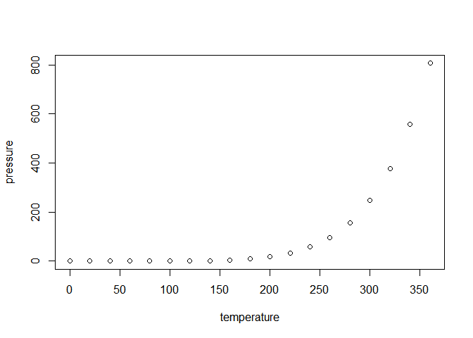

<!-- README.md is generated from README.Rmd. Please edit that file -->

# MRAS

<!-- badges: start -->
<!-- badges: end -->

MRAS is designed to identify crucial RNA-binding proteins (RBPs)
responsible for splicing variations in diverse scenarios, including
cancer vs. normal, primary vs. recurrence, and more, not just in bulk
data but also in single-cell data.

## Installation

You can install the development version of MRAS from
[GitHub](https://github.com/) with:

``` r
# install.packages("devtools")
devtools::install_github("zhou-lei5/MRAS")
```

## Example

This is a basic example which shows you how to solve a common problem:

``` r
library(MRAS)
#> Loading required package: data.table
#> Loading required package: fgsea
## basic example code
```

What is special about using `README.Rmd` instead of just `README.md`?
You can include R chunks like so:

``` r
## "expr" is RBP expression matrix.
data("expr")
head(expr)
#>        SRR5962198 SRR5962199  SRR5962200  SRR5962201 SRR5962202  SRR5962203
#> A1CF    0.1005414  0.0000000  0.03379508  0.04432587  1.1422434  0.02259863
#> ANKHD1  0.8390107  0.7166435  0.77311709  0.77295568  2.2460320  0.82911941
#> CELF1  19.4532827 18.6930904 11.78120909 16.90546963 21.4689576 22.45192249
#> CELF2  29.7642191 25.5567231 11.75549788 26.64966474 16.2681018 27.81306236
#> CELF3   0.0000000  0.0840603  0.06387838  0.10054003  0.3084332  0.06407283
#> CELF4   0.1779768  0.5398241  0.09400841  0.20176711  0.6052191  0.44575620
#>         SRR5962204  SRR5962205 SRR5962206 SRR5962207 SRR5962208 SRR5962209
#> A1CF    0.02480322  0.08323182  0.2899572  0.2700664  0.1632731  0.1561559
#> ANKHD1  0.80447362  0.85323555  0.8098295  0.9325593  2.1142277  2.1078520
#> CELF1  23.14961262 12.24848444 18.5594374 16.4799832 21.6878299 24.3717269
#> CELF2  18.74557072 10.75278341 19.9745964 23.9011156  9.4538126 22.1500397
#> CELF3   0.13060061  0.05899580  0.2417946  0.1093866  0.5621176  0.5433644
#> CELF4   0.14515958  0.06314387  0.1811569  0.2926943  1.8757036  0.7538858
#>        SRR5962210  SRR5962211 SRR5962212  SRR5962213 SRR5962214  SRR5962215
#> A1CF    0.0000000  0.00000000  1.3793752  0.08037936  0.2361368  0.06830795
#> ANKHD1  1.2124087  0.47751127  0.9577943  2.18575274  2.0130136  1.11132200
#> CELF1  10.9004600 21.57046466 21.8254527 28.28287426 35.3409517 23.90267876
#> CELF2  11.5793517 15.41198044 11.5533692  8.69584357 36.2122446 32.37326451
#> CELF3   0.1720592  0.08111902  4.6335389  0.84511347  0.5858190  0.18622142
#> CELF4   0.3683138  0.28940865  1.7971880  0.50816543  0.4926496  0.23120526
#>        SRR5962216  SRR5962217  SRR5962218 SRR5962219 SRR5962220  SRR5962221
#> A1CF    0.1298457  0.08438851  0.03293641 0.03775780   0.000000  0.06326077
#> ANKHD1  2.3641164  0.87419942  2.39243138 0.30266899   1.522107  2.87618114
#> CELF1  22.2200021 15.84680462 22.66694042 6.59072708  13.234323 28.22114058
#> CELF2  20.4993338 22.39225471 14.31845700 3.18191604   3.070435  6.49960932
#> CELF3   0.2426413  0.08374196  0.35352152 0.10705289   0.000000  0.29893374
#> CELF4   0.1432837  0.10243424  0.37123885 0.09002708   0.000000  0.41593779
#>         SRR5962222  SRR5962223  SRR5962224 SRR5962225 SRR5962226 SRR5962227
#> A1CF    0.07256164  0.03390166  0.23944272  0.3136890  0.2011262 0.01385641
#> ANKHD1  1.22774760  1.44867888  1.34357197  1.5929286  2.1076256 0.83533291
#> CELF1  18.54417441 27.97544220 23.52100029 25.7975647 18.4612287 6.95256536
#> CELF2   1.50999589  3.58647701 12.23922843  7.8083165  8.7268860 4.31318127
#> CELF3   0.16458445  0.21626948  0.28952258  1.0201797  0.5385633 0.04583417
#> CELF4   0.06605872  0.25719518  0.07479845  0.6252817  0.5425227 0.06307307
#>        SRR5962228  SRR5962229 SRR5962230 SRR5962231 SRR5962232  SRR5962233
#> A1CF    0.1725554  0.02617946  0.1117867  0.1898374 0.02011474  0.03204675
#> ANKHD1  1.2214853  1.22792799  1.9868043  1.1471647 0.94057301  0.98210575
#> CELF1  32.4188200 22.30973224 20.8972137 28.3252870 9.04350104 10.51814085
#> CELF2   6.5807192  3.52556008  7.6492412  5.7380034 4.76088791  2.51826804
#> CELF3   0.2446190  0.35875592  0.2982997  0.7304644 0.09029809  0.23850912
#> CELF4   0.3403640  0.14564778  0.1995460  0.1645946 0.05086687  0.12156143
#>        SRR5962234 SRR5962235  SRR5962236 SRR5962237  SRR5962238  SRR5962239
#> A1CF    0.5711683   1.556982  0.08094513  0.0000000  0.06443257  0.08820638
#> ANKHD1  1.5355660   1.714405  1.77313870  1.2668094  2.53480192  2.74124890
#> CELF1  28.2913513  27.304739 21.36606542 30.1422524 23.58243999 33.36288206
#> CELF2   3.5522772  10.222865 10.16223218 11.7698804  3.44224166 20.75693852
#> CELF3   2.0820938   5.765793  0.20081239  0.1381116  0.37841394  0.29176859
#> CELF4   0.7056880   2.772216  0.16119882  0.1016279  0.42597005  0.12491329
#>         SRR5962240 SRR5962241
#> A1CF    0.05596903  1.4790731
#> ANKHD1  3.32174630  0.9078093
#> CELF1  35.15455103  9.8163853
#> CELF2  14.43090854  4.4218172
#> CELF3   0.64466325  3.9269041
#> CELF4   0.42460944  2.9447012
```

``` r
## "psi" is events psi matrix."expr" and "psi" should have same column names.
data("psi")
head(psi)
#>                                                                                               SRR5962198
#> ENSG00000147403.18_RPL10_chrX_+_154400463_154400626_154399802_154399941_154400701_154400811        0.984
#> ENSG00000196924.19_FLNA_chrX_-_154357250_154357274_154354824_154355072_154357433_154357623         0.407
#> ENSG00000101972.20_STAG2_chrX_+_124090853_124090964_124090574_124090764_124094017_124094144        0.213
#> ENSG00000123562.18_MORF4L2_chrX_-_103684680_103684729_103678498_103678600_103685170_103685260      0.402
#> ENSG00000123562.18_MORF4L2_chrX_-_103684680_103684729_103678498_103678651_103685170_103685260      0.402
#> ENSG00000102317.18_RBM3_chrX_+_48575814_48576083_48575560_48575667_48576313_48576419               0.018
#>                                                                                               SRR5962199
#> ENSG00000147403.18_RPL10_chrX_+_154400463_154400626_154399802_154399941_154400701_154400811        0.969
#> ENSG00000196924.19_FLNA_chrX_-_154357250_154357274_154354824_154355072_154357433_154357623         0.399
#> ENSG00000101972.20_STAG2_chrX_+_124090853_124090964_124090574_124090764_124094017_124094144        0.213
#> ENSG00000123562.18_MORF4L2_chrX_-_103684680_103684729_103678498_103678600_103685170_103685260      0.402
#> ENSG00000123562.18_MORF4L2_chrX_-_103684680_103684729_103678498_103678651_103685170_103685260      0.000
#> ENSG00000102317.18_RBM3_chrX_+_48575814_48576083_48575560_48575667_48576313_48576419               0.009
#>                                                                                               SRR5962200
#> ENSG00000147403.18_RPL10_chrX_+_154400463_154400626_154399802_154399941_154400701_154400811        0.969
#> ENSG00000196924.19_FLNA_chrX_-_154357250_154357274_154354824_154355072_154357433_154357623         0.322
#> ENSG00000101972.20_STAG2_chrX_+_124090853_124090964_124090574_124090764_124094017_124094144        0.255
#> ENSG00000123562.18_MORF4L2_chrX_-_103684680_103684729_103678498_103678600_103685170_103685260      0.251
#> ENSG00000123562.18_MORF4L2_chrX_-_103684680_103684729_103678498_103678651_103685170_103685260      0.192
#> ENSG00000102317.18_RBM3_chrX_+_48575814_48576083_48575560_48575667_48576313_48576419               0.017
#>                                                                                               SRR5962201
#> ENSG00000147403.18_RPL10_chrX_+_154400463_154400626_154399802_154399941_154400701_154400811        0.978
#> ENSG00000196924.19_FLNA_chrX_-_154357250_154357274_154354824_154355072_154357433_154357623         0.463
#> ENSG00000101972.20_STAG2_chrX_+_124090853_124090964_124090574_124090764_124094017_124094144        0.172
#> ENSG00000123562.18_MORF4L2_chrX_-_103684680_103684729_103678498_103678600_103685170_103685260      0.173
#> ENSG00000123562.18_MORF4L2_chrX_-_103684680_103684729_103678498_103678651_103685170_103685260      0.322
#> ENSG00000102317.18_RBM3_chrX_+_48575814_48576083_48575560_48575667_48576313_48576419               0.018
#>                                                                                               SRR5962202
#> ENSG00000147403.18_RPL10_chrX_+_154400463_154400626_154399802_154399941_154400701_154400811        0.961
#> ENSG00000196924.19_FLNA_chrX_-_154357250_154357274_154354824_154355072_154357433_154357623         0.514
#> ENSG00000101972.20_STAG2_chrX_+_124090853_124090964_124090574_124090764_124094017_124094144        0.237
#> ENSG00000123562.18_MORF4L2_chrX_-_103684680_103684729_103678498_103678600_103685170_103685260      0.198
#> ENSG00000123562.18_MORF4L2_chrX_-_103684680_103684729_103678498_103678651_103685170_103685260      0.242
#> ENSG00000102317.18_RBM3_chrX_+_48575814_48576083_48575560_48575667_48576313_48576419               0.055
#>                                                                                               SRR5962203
#> ENSG00000147403.18_RPL10_chrX_+_154400463_154400626_154399802_154399941_154400701_154400811        0.978
#> ENSG00000196924.19_FLNA_chrX_-_154357250_154357274_154354824_154355072_154357433_154357623         0.257
#> ENSG00000101972.20_STAG2_chrX_+_124090853_124090964_124090574_124090764_124094017_124094144        0.099
#> ENSG00000123562.18_MORF4L2_chrX_-_103684680_103684729_103678498_103678600_103685170_103685260      0.267
#> ENSG00000123562.18_MORF4L2_chrX_-_103684680_103684729_103678498_103678651_103685170_103685260      0.381
#> ENSG00000102317.18_RBM3_chrX_+_48575814_48576083_48575560_48575667_48576313_48576419               0.055
#>                                                                                               SRR5962204
#> ENSG00000147403.18_RPL10_chrX_+_154400463_154400626_154399802_154399941_154400701_154400811        0.983
#> ENSG00000196924.19_FLNA_chrX_-_154357250_154357274_154354824_154355072_154357433_154357623         0.456
#> ENSG00000101972.20_STAG2_chrX_+_124090853_124090964_124090574_124090764_124094017_124094144        0.147
#> ENSG00000123562.18_MORF4L2_chrX_-_103684680_103684729_103678498_103678600_103685170_103685260      0.245
#> ENSG00000123562.18_MORF4L2_chrX_-_103684680_103684729_103678498_103678651_103685170_103685260      0.371
#> ENSG00000102317.18_RBM3_chrX_+_48575814_48576083_48575560_48575667_48576313_48576419               0.016
#>                                                                                               SRR5962205
#> ENSG00000147403.18_RPL10_chrX_+_154400463_154400626_154399802_154399941_154400701_154400811        0.981
#> ENSG00000196924.19_FLNA_chrX_-_154357250_154357274_154354824_154355072_154357433_154357623         0.452
#> ENSG00000101972.20_STAG2_chrX_+_124090853_124090964_124090574_124090764_124094017_124094144        0.279
#> ENSG00000123562.18_MORF4L2_chrX_-_103684680_103684729_103678498_103678600_103685170_103685260      0.299
#> ENSG00000123562.18_MORF4L2_chrX_-_103684680_103684729_103678498_103678651_103685170_103685260      0.439
#> ENSG00000102317.18_RBM3_chrX_+_48575814_48576083_48575560_48575667_48576313_48576419               0.014
#>                                                                                               SRR5962206
#> ENSG00000147403.18_RPL10_chrX_+_154400463_154400626_154399802_154399941_154400701_154400811        0.978
#> ENSG00000196924.19_FLNA_chrX_-_154357250_154357274_154354824_154355072_154357433_154357623         0.480
#> ENSG00000101972.20_STAG2_chrX_+_124090853_124090964_124090574_124090764_124094017_124094144        0.229
#> ENSG00000123562.18_MORF4L2_chrX_-_103684680_103684729_103678498_103678600_103685170_103685260      1.000
#> ENSG00000123562.18_MORF4L2_chrX_-_103684680_103684729_103678498_103678651_103685170_103685260      0.183
#> ENSG00000102317.18_RBM3_chrX_+_48575814_48576083_48575560_48575667_48576313_48576419               0.055
#>                                                                                               SRR5962207
#> ENSG00000147403.18_RPL10_chrX_+_154400463_154400626_154399802_154399941_154400701_154400811        0.989
#> ENSG00000196924.19_FLNA_chrX_-_154357250_154357274_154354824_154355072_154357433_154357623         0.325
#> ENSG00000101972.20_STAG2_chrX_+_124090853_124090964_124090574_124090764_124094017_124094144        0.056
#> ENSG00000123562.18_MORF4L2_chrX_-_103684680_103684729_103678498_103678600_103685170_103685260      0.201
#> ENSG00000123562.18_MORF4L2_chrX_-_103684680_103684729_103678498_103678651_103685170_103685260      0.183
#> ENSG00000102317.18_RBM3_chrX_+_48575814_48576083_48575560_48575667_48576313_48576419               0.023
#>                                                                                               SRR5962208
#> ENSG00000147403.18_RPL10_chrX_+_154400463_154400626_154399802_154399941_154400701_154400811        1.000
#> ENSG00000196924.19_FLNA_chrX_-_154357250_154357274_154354824_154355072_154357433_154357623         0.617
#> ENSG00000101972.20_STAG2_chrX_+_124090853_124090964_124090574_124090764_124094017_124094144        0.221
#> ENSG00000123562.18_MORF4L2_chrX_-_103684680_103684729_103678498_103678600_103685170_103685260      0.402
#> ENSG00000123562.18_MORF4L2_chrX_-_103684680_103684729_103678498_103678651_103685170_103685260      0.106
#> ENSG00000102317.18_RBM3_chrX_+_48575814_48576083_48575560_48575667_48576313_48576419               0.185
#>                                                                                               SRR5962209
#> ENSG00000147403.18_RPL10_chrX_+_154400463_154400626_154399802_154399941_154400701_154400811        0.974
#> ENSG00000196924.19_FLNA_chrX_-_154357250_154357274_154354824_154355072_154357433_154357623         0.492
#> ENSG00000101972.20_STAG2_chrX_+_124090853_124090964_124090574_124090764_124094017_124094144        0.345
#> ENSG00000123562.18_MORF4L2_chrX_-_103684680_103684729_103678498_103678600_103685170_103685260      0.097
#> ENSG00000123562.18_MORF4L2_chrX_-_103684680_103684729_103678498_103678651_103685170_103685260      0.272
#> ENSG00000102317.18_RBM3_chrX_+_48575814_48576083_48575560_48575667_48576313_48576419               0.039
#>                                                                                               SRR5962210
#> ENSG00000147403.18_RPL10_chrX_+_154400463_154400626_154399802_154399941_154400701_154400811        0.981
#> ENSG00000196924.19_FLNA_chrX_-_154357250_154357274_154354824_154355072_154357433_154357623         0.488
#> ENSG00000101972.20_STAG2_chrX_+_124090853_124090964_124090574_124090764_124094017_124094144        0.000
#> ENSG00000123562.18_MORF4L2_chrX_-_103684680_103684729_103678498_103678600_103685170_103685260      0.000
#> ENSG00000123562.18_MORF4L2_chrX_-_103684680_103684729_103678498_103678651_103685170_103685260      0.161
#> ENSG00000102317.18_RBM3_chrX_+_48575814_48576083_48575560_48575667_48576313_48576419               0.010
#>                                                                                               SRR5962211
#> ENSG00000147403.18_RPL10_chrX_+_154400463_154400626_154399802_154399941_154400701_154400811        0.982
#> ENSG00000196924.19_FLNA_chrX_-_154357250_154357274_154354824_154355072_154357433_154357623         0.300
#> ENSG00000101972.20_STAG2_chrX_+_124090853_124090964_124090574_124090764_124094017_124094144        0.322
#> ENSG00000123562.18_MORF4L2_chrX_-_103684680_103684729_103678498_103678600_103685170_103685260      0.251
#> ENSG00000123562.18_MORF4L2_chrX_-_103684680_103684729_103678498_103678651_103685170_103685260      0.402
#> ENSG00000102317.18_RBM3_chrX_+_48575814_48576083_48575560_48575667_48576313_48576419               0.035
#>                                                                                               SRR5962212
#> ENSG00000147403.18_RPL10_chrX_+_154400463_154400626_154399802_154399941_154400701_154400811        0.989
#> ENSG00000196924.19_FLNA_chrX_-_154357250_154357274_154354824_154355072_154357433_154357623         0.473
#> ENSG00000101972.20_STAG2_chrX_+_124090853_124090964_124090574_124090764_124094017_124094144        0.356
#> ENSG00000123562.18_MORF4L2_chrX_-_103684680_103684729_103678498_103678600_103685170_103685260      0.316
#> ENSG00000123562.18_MORF4L2_chrX_-_103684680_103684729_103678498_103678651_103685170_103685260      0.359
#> ENSG00000102317.18_RBM3_chrX_+_48575814_48576083_48575560_48575667_48576313_48576419               0.034
#>                                                                                               SRR5962213
#> ENSG00000147403.18_RPL10_chrX_+_154400463_154400626_154399802_154399941_154400701_154400811        0.990
#> ENSG00000196924.19_FLNA_chrX_-_154357250_154357274_154354824_154355072_154357433_154357623         0.527
#> ENSG00000101972.20_STAG2_chrX_+_124090853_124090964_124090574_124090764_124094017_124094144        0.213
#> ENSG00000123562.18_MORF4L2_chrX_-_103684680_103684729_103678498_103678600_103685170_103685260      0.219
#> ENSG00000123562.18_MORF4L2_chrX_-_103684680_103684729_103678498_103678651_103685170_103685260      0.365
#> ENSG00000102317.18_RBM3_chrX_+_48575814_48576083_48575560_48575667_48576313_48576419               0.089
#>                                                                                               SRR5962214
#> ENSG00000147403.18_RPL10_chrX_+_154400463_154400626_154399802_154399941_154400701_154400811        0.979
#> ENSG00000196924.19_FLNA_chrX_-_154357250_154357274_154354824_154355072_154357433_154357623         0.461
#> ENSG00000101972.20_STAG2_chrX_+_124090853_124090964_124090574_124090764_124094017_124094144        0.254
#> ENSG00000123562.18_MORF4L2_chrX_-_103684680_103684729_103678498_103678600_103685170_103685260      0.190
#> ENSG00000123562.18_MORF4L2_chrX_-_103684680_103684729_103678498_103678651_103685170_103685260      0.402
#> ENSG00000102317.18_RBM3_chrX_+_48575814_48576083_48575560_48575667_48576313_48576419               0.048
#>                                                                                               SRR5962215
#> ENSG00000147403.18_RPL10_chrX_+_154400463_154400626_154399802_154399941_154400701_154400811        0.987
#> ENSG00000196924.19_FLNA_chrX_-_154357250_154357274_154354824_154355072_154357433_154357623         0.363
#> ENSG00000101972.20_STAG2_chrX_+_124090853_124090964_124090574_124090764_124094017_124094144        0.151
#> ENSG00000123562.18_MORF4L2_chrX_-_103684680_103684729_103678498_103678600_103685170_103685260      0.179
#> ENSG00000123562.18_MORF4L2_chrX_-_103684680_103684729_103678498_103678651_103685170_103685260      0.384
#> ENSG00000102317.18_RBM3_chrX_+_48575814_48576083_48575560_48575667_48576313_48576419               0.032
#>                                                                                               SRR5962216
#> ENSG00000147403.18_RPL10_chrX_+_154400463_154400626_154399802_154399941_154400701_154400811        0.981
#> ENSG00000196924.19_FLNA_chrX_-_154357250_154357274_154354824_154355072_154357433_154357623         0.452
#> ENSG00000101972.20_STAG2_chrX_+_124090853_124090964_124090574_124090764_124094017_124094144        0.232
#> ENSG00000123562.18_MORF4L2_chrX_-_103684680_103684729_103678498_103678600_103685170_103685260      0.212
#> ENSG00000123562.18_MORF4L2_chrX_-_103684680_103684729_103678498_103678651_103685170_103685260      0.219
#> ENSG00000102317.18_RBM3_chrX_+_48575814_48576083_48575560_48575667_48576313_48576419               0.043
#>                                                                                               SRR5962217
#> ENSG00000147403.18_RPL10_chrX_+_154400463_154400626_154399802_154399941_154400701_154400811        0.986
#> ENSG00000196924.19_FLNA_chrX_-_154357250_154357274_154354824_154355072_154357433_154357623         0.405
#> ENSG00000101972.20_STAG2_chrX_+_124090853_124090964_124090574_124090764_124094017_124094144        0.078
#> ENSG00000123562.18_MORF4L2_chrX_-_103684680_103684729_103678498_103678600_103685170_103685260      0.172
#> ENSG00000123562.18_MORF4L2_chrX_-_103684680_103684729_103678498_103678651_103685170_103685260      0.480
#> ENSG00000102317.18_RBM3_chrX_+_48575814_48576083_48575560_48575667_48576313_48576419               0.010
#>                                                                                               SRR5962218
#> ENSG00000147403.18_RPL10_chrX_+_154400463_154400626_154399802_154399941_154400701_154400811        0.974
#> ENSG00000196924.19_FLNA_chrX_-_154357250_154357274_154354824_154355072_154357433_154357623         0.445
#> ENSG00000101972.20_STAG2_chrX_+_124090853_124090964_124090574_124090764_124094017_124094144        0.085
#> ENSG00000123562.18_MORF4L2_chrX_-_103684680_103684729_103678498_103678600_103685170_103685260      0.175
#> ENSG00000123562.18_MORF4L2_chrX_-_103684680_103684729_103678498_103678651_103685170_103685260      0.226
#> ENSG00000102317.18_RBM3_chrX_+_48575814_48576083_48575560_48575667_48576313_48576419               0.121
#>                                                                                               SRR5962219
#> ENSG00000147403.18_RPL10_chrX_+_154400463_154400626_154399802_154399941_154400701_154400811        0.966
#> ENSG00000196924.19_FLNA_chrX_-_154357250_154357274_154354824_154355072_154357433_154357623         0.622
#> ENSG00000101972.20_STAG2_chrX_+_124090853_124090964_124090574_124090764_124094017_124094144        0.082
#> ENSG00000123562.18_MORF4L2_chrX_-_103684680_103684729_103678498_103678600_103685170_103685260      0.196
#> ENSG00000123562.18_MORF4L2_chrX_-_103684680_103684729_103678498_103678651_103685170_103685260      0.193
#> ENSG00000102317.18_RBM3_chrX_+_48575814_48576083_48575560_48575667_48576313_48576419               0.028
#>                                                                                               SRR5962220
#> ENSG00000147403.18_RPL10_chrX_+_154400463_154400626_154399802_154399941_154400701_154400811        1.000
#> ENSG00000196924.19_FLNA_chrX_-_154357250_154357274_154354824_154355072_154357433_154357623         0.000
#> ENSG00000101972.20_STAG2_chrX_+_124090853_124090964_124090574_124090764_124094017_124094144        0.000
#> ENSG00000123562.18_MORF4L2_chrX_-_103684680_103684729_103678498_103678600_103685170_103685260      0.000
#> ENSG00000123562.18_MORF4L2_chrX_-_103684680_103684729_103678498_103678651_103685170_103685260      0.000
#> ENSG00000102317.18_RBM3_chrX_+_48575814_48576083_48575560_48575667_48576313_48576419               0.213
#>                                                                                               SRR5962221
#> ENSG00000147403.18_RPL10_chrX_+_154400463_154400626_154399802_154399941_154400701_154400811        0.958
#> ENSG00000196924.19_FLNA_chrX_-_154357250_154357274_154354824_154355072_154357433_154357623         0.699
#> ENSG00000101972.20_STAG2_chrX_+_124090853_124090964_124090574_124090764_124094017_124094144        0.106
#> ENSG00000123562.18_MORF4L2_chrX_-_103684680_103684729_103678498_103678600_103685170_103685260      0.359
#> ENSG00000123562.18_MORF4L2_chrX_-_103684680_103684729_103678498_103678651_103685170_103685260      0.402
#> ENSG00000102317.18_RBM3_chrX_+_48575814_48576083_48575560_48575667_48576313_48576419               0.102
#>                                                                                               SRR5962222
#> ENSG00000147403.18_RPL10_chrX_+_154400463_154400626_154399802_154399941_154400701_154400811        0.985
#> ENSG00000196924.19_FLNA_chrX_-_154357250_154357274_154354824_154355072_154357433_154357623         0.729
#> ENSG00000101972.20_STAG2_chrX_+_124090853_124090964_124090574_124090764_124094017_124094144        0.106
#> ENSG00000123562.18_MORF4L2_chrX_-_103684680_103684729_103678498_103678600_103685170_103685260      0.324
#> ENSG00000123562.18_MORF4L2_chrX_-_103684680_103684729_103678498_103678651_103685170_103685260      0.251
#> ENSG00000102317.18_RBM3_chrX_+_48575814_48576083_48575560_48575667_48576313_48576419               0.051
#>                                                                                               SRR5962223
#> ENSG00000147403.18_RPL10_chrX_+_154400463_154400626_154399802_154399941_154400701_154400811        0.963
#> ENSG00000196924.19_FLNA_chrX_-_154357250_154357274_154354824_154355072_154357433_154357623         0.653
#> ENSG00000101972.20_STAG2_chrX_+_124090853_124090964_124090574_124090764_124094017_124094144        0.356
#> ENSG00000123562.18_MORF4L2_chrX_-_103684680_103684729_103678498_103678600_103685170_103685260      0.402
#> ENSG00000123562.18_MORF4L2_chrX_-_103684680_103684729_103678498_103678651_103685170_103685260      0.427
#> ENSG00000102317.18_RBM3_chrX_+_48575814_48576083_48575560_48575667_48576313_48576419               0.033
#>                                                                                               SRR5962224
#> ENSG00000147403.18_RPL10_chrX_+_154400463_154400626_154399802_154399941_154400701_154400811        0.998
#> ENSG00000196924.19_FLNA_chrX_-_154357250_154357274_154354824_154355072_154357433_154357623         0.640
#> ENSG00000101972.20_STAG2_chrX_+_124090853_124090964_124090574_124090764_124094017_124094144        0.220
#> ENSG00000123562.18_MORF4L2_chrX_-_103684680_103684729_103678498_103678600_103685170_103685260      0.265
#> ENSG00000123562.18_MORF4L2_chrX_-_103684680_103684729_103678498_103678651_103685170_103685260      0.407
#> ENSG00000102317.18_RBM3_chrX_+_48575814_48576083_48575560_48575667_48576313_48576419               0.028
#>                                                                                               SRR5962225
#> ENSG00000147403.18_RPL10_chrX_+_154400463_154400626_154399802_154399941_154400701_154400811        0.990
#> ENSG00000196924.19_FLNA_chrX_-_154357250_154357274_154354824_154355072_154357433_154357623         0.783
#> ENSG00000101972.20_STAG2_chrX_+_124090853_124090964_124090574_124090764_124094017_124094144        0.188
#> ENSG00000123562.18_MORF4L2_chrX_-_103684680_103684729_103678498_103678600_103685170_103685260      0.317
#> ENSG00000123562.18_MORF4L2_chrX_-_103684680_103684729_103678498_103678651_103685170_103685260      0.396
#> ENSG00000102317.18_RBM3_chrX_+_48575814_48576083_48575560_48575667_48576313_48576419               0.166
#>                                                                                               SRR5962226
#> ENSG00000147403.18_RPL10_chrX_+_154400463_154400626_154399802_154399941_154400701_154400811        0.984
#> ENSG00000196924.19_FLNA_chrX_-_154357250_154357274_154354824_154355072_154357433_154357623         0.537
#> ENSG00000101972.20_STAG2_chrX_+_124090853_124090964_124090574_124090764_124094017_124094144        0.189
#> ENSG00000123562.18_MORF4L2_chrX_-_103684680_103684729_103678498_103678600_103685170_103685260      0.215
#> ENSG00000123562.18_MORF4L2_chrX_-_103684680_103684729_103678498_103678651_103685170_103685260      0.312
#> ENSG00000102317.18_RBM3_chrX_+_48575814_48576083_48575560_48575667_48576313_48576419               0.043
#>                                                                                               SRR5962227
#> ENSG00000147403.18_RPL10_chrX_+_154400463_154400626_154399802_154399941_154400701_154400811        0.988
#> ENSG00000196924.19_FLNA_chrX_-_154357250_154357274_154354824_154355072_154357433_154357623         0.604
#> ENSG00000101972.20_STAG2_chrX_+_124090853_124090964_124090574_124090764_124094017_124094144        0.114
#> ENSG00000123562.18_MORF4L2_chrX_-_103684680_103684729_103678498_103678600_103685170_103685260      0.346
#> ENSG00000123562.18_MORF4L2_chrX_-_103684680_103684729_103678498_103678651_103685170_103685260      0.253
#> ENSG00000102317.18_RBM3_chrX_+_48575814_48576083_48575560_48575667_48576313_48576419               0.035
#>                                                                                               SRR5962228
#> ENSG00000147403.18_RPL10_chrX_+_154400463_154400626_154399802_154399941_154400701_154400811        0.964
#> ENSG00000196924.19_FLNA_chrX_-_154357250_154357274_154354824_154355072_154357433_154357623         0.734
#> ENSG00000101972.20_STAG2_chrX_+_124090853_124090964_124090574_124090764_124094017_124094144        0.106
#> ENSG00000123562.18_MORF4L2_chrX_-_103684680_103684729_103678498_103678600_103685170_103685260      0.402
#> ENSG00000123562.18_MORF4L2_chrX_-_103684680_103684729_103678498_103678651_103685170_103685260      0.434
#> ENSG00000102317.18_RBM3_chrX_+_48575814_48576083_48575560_48575667_48576313_48576419               0.038
#>                                                                                               SRR5962229
#> ENSG00000147403.18_RPL10_chrX_+_154400463_154400626_154399802_154399941_154400701_154400811        0.978
#> ENSG00000196924.19_FLNA_chrX_-_154357250_154357274_154354824_154355072_154357433_154357623         0.708
#> ENSG00000101972.20_STAG2_chrX_+_124090853_124090964_124090574_124090764_124094017_124094144        0.158
#> ENSG00000123562.18_MORF4L2_chrX_-_103684680_103684729_103678498_103678600_103685170_103685260      0.312
#> ENSG00000123562.18_MORF4L2_chrX_-_103684680_103684729_103678498_103678651_103685170_103685260      0.365
#> ENSG00000102317.18_RBM3_chrX_+_48575814_48576083_48575560_48575667_48576313_48576419               0.044
#>                                                                                               SRR5962230
#> ENSG00000147403.18_RPL10_chrX_+_154400463_154400626_154399802_154399941_154400701_154400811        0.996
#> ENSG00000196924.19_FLNA_chrX_-_154357250_154357274_154354824_154355072_154357433_154357623         0.772
#> ENSG00000101972.20_STAG2_chrX_+_124090853_124090964_124090574_124090764_124094017_124094144        0.265
#> ENSG00000123562.18_MORF4L2_chrX_-_103684680_103684729_103678498_103678600_103685170_103685260      0.542
#> ENSG00000123562.18_MORF4L2_chrX_-_103684680_103684729_103678498_103678651_103685170_103685260      0.351
#> ENSG00000102317.18_RBM3_chrX_+_48575814_48576083_48575560_48575667_48576313_48576419               0.058
#>                                                                                               SRR5962231
#> ENSG00000147403.18_RPL10_chrX_+_154400463_154400626_154399802_154399941_154400701_154400811        0.970
#> ENSG00000196924.19_FLNA_chrX_-_154357250_154357274_154354824_154355072_154357433_154357623         0.905
#> ENSG00000101972.20_STAG2_chrX_+_124090853_124090964_124090574_124090764_124094017_124094144        0.154
#> ENSG00000123562.18_MORF4L2_chrX_-_103684680_103684729_103678498_103678600_103685170_103685260      0.365
#> ENSG00000123562.18_MORF4L2_chrX_-_103684680_103684729_103678498_103678651_103685170_103685260      0.513
#> ENSG00000102317.18_RBM3_chrX_+_48575814_48576083_48575560_48575667_48576313_48576419               0.016
#>                                                                                               SRR5962232
#> ENSG00000147403.18_RPL10_chrX_+_154400463_154400626_154399802_154399941_154400701_154400811        0.992
#> ENSG00000196924.19_FLNA_chrX_-_154357250_154357274_154354824_154355072_154357433_154357623         0.773
#> ENSG00000101972.20_STAG2_chrX_+_124090853_124090964_124090574_124090764_124094017_124094144        0.136
#> ENSG00000123562.18_MORF4L2_chrX_-_103684680_103684729_103678498_103678600_103685170_103685260      0.216
#> ENSG00000123562.18_MORF4L2_chrX_-_103684680_103684729_103678498_103678651_103685170_103685260      0.282
#> ENSG00000102317.18_RBM3_chrX_+_48575814_48576083_48575560_48575667_48576313_48576419               0.026
#>                                                                                               SRR5962233
#> ENSG00000147403.18_RPL10_chrX_+_154400463_154400626_154399802_154399941_154400701_154400811        0.993
#> ENSG00000196924.19_FLNA_chrX_-_154357250_154357274_154354824_154355072_154357433_154357623         0.842
#> ENSG00000101972.20_STAG2_chrX_+_124090853_124090964_124090574_124090764_124094017_124094144        0.255
#> ENSG00000123562.18_MORF4L2_chrX_-_103684680_103684729_103678498_103678600_103685170_103685260      0.097
#> ENSG00000123562.18_MORF4L2_chrX_-_103684680_103684729_103678498_103678651_103685170_103685260      0.150
#> ENSG00000102317.18_RBM3_chrX_+_48575814_48576083_48575560_48575667_48576313_48576419               0.066
#>                                                                                               SRR5962234
#> ENSG00000147403.18_RPL10_chrX_+_154400463_154400626_154399802_154399941_154400701_154400811        0.990
#> ENSG00000196924.19_FLNA_chrX_-_154357250_154357274_154354824_154355072_154357433_154357623         0.687
#> ENSG00000101972.20_STAG2_chrX_+_124090853_124090964_124090574_124090764_124094017_124094144        0.247
#> ENSG00000123562.18_MORF4L2_chrX_-_103684680_103684729_103678498_103678600_103685170_103685260      0.322
#> ENSG00000123562.18_MORF4L2_chrX_-_103684680_103684729_103678498_103678651_103685170_103685260      0.487
#> ENSG00000102317.18_RBM3_chrX_+_48575814_48576083_48575560_48575667_48576313_48576419               0.044
#>                                                                                               SRR5962235
#> ENSG00000147403.18_RPL10_chrX_+_154400463_154400626_154399802_154399941_154400701_154400811        0.987
#> ENSG00000196924.19_FLNA_chrX_-_154357250_154357274_154354824_154355072_154357433_154357623         0.803
#> ENSG00000101972.20_STAG2_chrX_+_124090853_124090964_124090574_124090764_124094017_124094144        0.079
#> ENSG00000123562.18_MORF4L2_chrX_-_103684680_103684729_103678498_103678600_103685170_103685260      0.370
#> ENSG00000123562.18_MORF4L2_chrX_-_103684680_103684729_103678498_103678651_103685170_103685260      0.467
#> ENSG00000102317.18_RBM3_chrX_+_48575814_48576083_48575560_48575667_48576313_48576419               0.026
#>                                                                                               SRR5962236
#> ENSG00000147403.18_RPL10_chrX_+_154400463_154400626_154399802_154399941_154400701_154400811        0.995
#> ENSG00000196924.19_FLNA_chrX_-_154357250_154357274_154354824_154355072_154357433_154357623         0.587
#> ENSG00000101972.20_STAG2_chrX_+_124090853_124090964_124090574_124090764_124094017_124094144        0.106
#> ENSG00000123562.18_MORF4L2_chrX_-_103684680_103684729_103678498_103678600_103685170_103685260      0.277
#> ENSG00000123562.18_MORF4L2_chrX_-_103684680_103684729_103678498_103678651_103685170_103685260      0.379
#> ENSG00000102317.18_RBM3_chrX_+_48575814_48576083_48575560_48575667_48576313_48576419               0.070
#>                                                                                               SRR5962237
#> ENSG00000147403.18_RPL10_chrX_+_154400463_154400626_154399802_154399941_154400701_154400811        0.983
#> ENSG00000196924.19_FLNA_chrX_-_154357250_154357274_154354824_154355072_154357433_154357623         0.739
#> ENSG00000101972.20_STAG2_chrX_+_124090853_124090964_124090574_124090764_124094017_124094144        0.221
#> ENSG00000123562.18_MORF4L2_chrX_-_103684680_103684729_103678498_103678600_103685170_103685260      0.236
#> ENSG00000123562.18_MORF4L2_chrX_-_103684680_103684729_103678498_103678651_103685170_103685260      0.287
#> ENSG00000102317.18_RBM3_chrX_+_48575814_48576083_48575560_48575667_48576313_48576419               0.030
#>                                                                                               SRR5962238
#> ENSG00000147403.18_RPL10_chrX_+_154400463_154400626_154399802_154399941_154400701_154400811        0.973
#> ENSG00000196924.19_FLNA_chrX_-_154357250_154357274_154354824_154355072_154357433_154357623         0.783
#> ENSG00000101972.20_STAG2_chrX_+_124090853_124090964_124090574_124090764_124094017_124094144        0.365
#> ENSG00000123562.18_MORF4L2_chrX_-_103684680_103684729_103678498_103678600_103685170_103685260      0.230
#> ENSG00000123562.18_MORF4L2_chrX_-_103684680_103684729_103678498_103678651_103685170_103685260      0.097
#> ENSG00000102317.18_RBM3_chrX_+_48575814_48576083_48575560_48575667_48576313_48576419               0.132
#>                                                                                               SRR5962239
#> ENSG00000147403.18_RPL10_chrX_+_154400463_154400626_154399802_154399941_154400701_154400811        0.984
#> ENSG00000196924.19_FLNA_chrX_-_154357250_154357274_154354824_154355072_154357433_154357623         0.613
#> ENSG00000101972.20_STAG2_chrX_+_124090853_124090964_124090574_124090764_124094017_124094144        0.151
#> ENSG00000123562.18_MORF4L2_chrX_-_103684680_103684729_103678498_103678600_103685170_103685260      0.225
#> ENSG00000123562.18_MORF4L2_chrX_-_103684680_103684729_103678498_103678651_103685170_103685260      0.383
#> ENSG00000102317.18_RBM3_chrX_+_48575814_48576083_48575560_48575667_48576313_48576419               0.021
#>                                                                                               SRR5962240
#> ENSG00000147403.18_RPL10_chrX_+_154400463_154400626_154399802_154399941_154400701_154400811        0.986
#> ENSG00000196924.19_FLNA_chrX_-_154357250_154357274_154354824_154355072_154357433_154357623         0.530
#> ENSG00000101972.20_STAG2_chrX_+_124090853_124090964_124090574_124090764_124094017_124094144        0.271
#> ENSG00000123562.18_MORF4L2_chrX_-_103684680_103684729_103678498_103678600_103685170_103685260      0.324
#> ENSG00000123562.18_MORF4L2_chrX_-_103684680_103684729_103678498_103678651_103685170_103685260      0.464
#> ENSG00000102317.18_RBM3_chrX_+_48575814_48576083_48575560_48575667_48576313_48576419               0.209
#>                                                                                               SRR5962241
#> ENSG00000147403.18_RPL10_chrX_+_154400463_154400626_154399802_154399941_154400701_154400811        0.961
#> ENSG00000196924.19_FLNA_chrX_-_154357250_154357274_154354824_154355072_154357433_154357623         0.784
#> ENSG00000101972.20_STAG2_chrX_+_124090853_124090964_124090574_124090764_124094017_124094144        0.341
#> ENSG00000123562.18_MORF4L2_chrX_-_103684680_103684729_103678498_103678600_103685170_103685260      0.217
#> ENSG00000123562.18_MORF4L2_chrX_-_103684680_103684729_103678498_103678651_103685170_103685260      0.168
#> ENSG00000102317.18_RBM3_chrX_+_48575814_48576083_48575560_48575667_48576313_48576419               0.055
```

``` r
## Users can utilize the MRAS function for a streamlined analysis, or execute individual steps separately if they prefer to have more control over specific aspects of the analysis.
a<-MRAS(
  expr,
  psi,
  rbp_interested = "ESRP1",
  m = 22,
  n = 22,
  DS_pvalue = 0.05,
  DS_dPSI = 0.1,
  method =  "spearman",
  num1 = 0.2,
  num2 = 10,
  dpsi_network_threshold = 0.1,
  Regulate_threshold = 0.5,
  threads = 6,
  path_use="./tests/",
  result_type = "Top10"
)
#> Step1:Performing differential splicing analysis...
#> Step2:Constructing RBP-Event regulatory relationship network...
#> Step3:Preparing for enrichment analysis...
#> Step4:Performing enrichment analysis...
#> Finish!
```

You’ll still need to render `README.Rmd` regularly, to keep `README.md`
up-to-date. `devtools::build_readme()` is handy for this. You could also
use GitHub Actions to re-render `README.Rmd` every time you push. An
example workflow can be found here:
<https://github.com/r-lib/actions/tree/v1/examples>.

You can also embed plots, for example:



In that case, don’t forget to commit and push the resulting figure
files, so they display on GitHub and CRAN.
