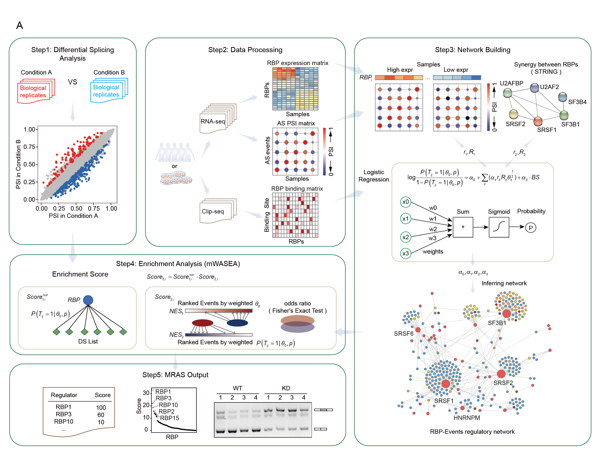

Menu
================

- <a href="#mras" id="toc-mras">MRAS</a>
  - <a href="#the-overview-of-mras" id="toc-the-overview-of-mras">The
    Overview of MRAS</a>
  - <a href="#installation-and-library"
    id="toc-installation-and-library">Installation and Library</a>
  - <a href="#usage-and-examples" id="toc-usage-and-examples">Usage and
    Examples</a>
    - <a href="#the-basic-code-of-input-type-1"
      id="toc-the-basic-code-of-input-type-1">The basic code of input type
      1</a>
    - <a href="#the-basic-code-of-input-type-2"
      id="toc-the-basic-code-of-input-type-2">The basic code of input type
      2</a>
    - <a href="#the-basic-code-of-input-type-3"
      id="toc-the-basic-code-of-input-type-3">The basic code of input type
      3</a>
      - <a href="#bulk-rna-seq" id="toc-bulk-rna-seq">BULK RNA-seq</a>
      - <a href="#single-cell-rna-seq" id="toc-single-cell-rna-seq">Single-cell
        RNA-seq</a>
  - <a href="#tools-as-events-id-converter"
    id="toc-tools-as-events-id-converter">Tools: AS Events ID converter</a>
    - <a href="#id_find" id="toc-id_find">id_find</a>
    - <a href="#id_normalization"
      id="toc-id_normalization">id_normalization</a>
    - <a href="#id_change" id="toc-id_change">id_change</a>
  - <a href="#help" id="toc-help">Help</a>

<!-- README.md is generated from README.Rmd. Please edit that file -->

# MRAS

<!-- badges: start -->
<!-- badges: end -->

MRAS is designed to identify crucial RNA-binding proteins (RBPs)
responsible for splicing variations in diverse scenarios, including
cancer vs. normal, primary vs. recurrence, and more, not just in bulk
data but also in single-cell data.

## The Overview of MRAS



## Installation and Library

You can install the development version of MRAS from
[GitHub](https://github.com/) with:

``` r
# install.packages("devtools")
devtools::install_github("zhou-lei5/MRAS")
library(MRAS)
```

## Usage and Examples

The easiest way to use MRAS: directly use the function `MRAS()`. The
specific parameters are detailed in `??MRAS` or `help(MRAS)`.

There are some basic descriptions which shows you how to use MRAS:

### The basic code of input type 1

Input type 1: Direct input of the set of alternative splicing events.

Firstly, you need to download the pre-constructed regulation network
generated by MRAS.In general, you will get two matrix:
“rbp_event_deal_all_total” and “rbp_event_deal_all”.

``` r
MRAS(input_type = "1",
     expr,psi,
     rbp_interested,
     m,n,
     DS_pvalue,DS_dPSI,
     rbp_event_deal_all_total,rbp_event_deal_all,
     result_type,threads,path_use)
```

### The basic code of input type 2

Input type 2: Reconstruct the network using inferred relationships.

Firstly, you need to download the inferred relationships generated by
MRAS. In general, yo will get one matrix: “rbp_net_mat_group”.

``` r
MRAS(input_type = "2",
     expr,psi,
     rbp_interested,
     m,n,
     DS_pvalue,DS_dPSI,
     rbp_net_mat_group,group,
     result_type,threads,path_use)
```

### The basic code of input type 3

Input type 3: Construct a network using the user’s own data.

Here, we have prepared some test data for users to better understand the
usage of MRAS. Test data is included in MRAS and you can import it using
data(), which contains the RBP expression matrix as well as the event
PSI matrix.

#### BULK RNA-seq

Use MRAS in bulk rna-seq data:

``` r
## "hcc_expr" is RBP expression matrix.
library(MRAS)
#> Loading required package: data.table
#> Loading required package: fgsea
data("hcc_expr")
hcc_expr[1:5,1:5]
#>        SRR3182261 SRR3129836 SRR3129837 SRR3129838 SRR3129839
#> A1CF   21.7575656 116.042384  47.071361  37.644303 54.8133944
#> ANKHD1  0.5555836   1.244645   0.727923   1.429632  0.8184703
#> CELF1  12.5222101  33.131067  29.052948  25.443336 26.5795453
#> CELF2   1.1010763   1.974816   3.688240   1.537169  1.4341667
#> CNOT4   2.6800668   4.430709   5.144975   3.858476  3.3844203
```

``` r
## "hcc_psi" is events psi matrix."hcc_expr" and "hcc_psi" should have same column names.
data("hcc_psi")
hcc_psi[1:5,1:3]
#>                                                                                SRR3182261
#> FAM3A_ES_chrX_-_153740638_153740735_153740181_153740204_153741147_153741260         0.118
#> FAM3A_ES_chrX_-_153740638_153740755_153740201_153740204_153741147_153741260         0.084
#> TAFAZZIN_ES_chrX_+_153642438_153642527_153641819_153641904_153647882_153647962      0.310
#> RPL10_ES_chrX_+_153628805_153628967_153628144_153628282_153629043_153629152         0.994
#> SSR4_ES_chrX_+_153061383_153061581_153060131_153060209_153061889_153062007          0.049
#>                                                                                SRR3129836
#> FAM3A_ES_chrX_-_153740638_153740735_153740181_153740204_153741147_153741260         0.150
#> FAM3A_ES_chrX_-_153740638_153740755_153740201_153740204_153741147_153741260         0.072
#> TAFAZZIN_ES_chrX_+_153642438_153642527_153641819_153641904_153647882_153647962      0.330
#> RPL10_ES_chrX_+_153628805_153628967_153628144_153628282_153629043_153629152         0.997
#> SSR4_ES_chrX_+_153061383_153061581_153060131_153060209_153061889_153062007          0.013
#>                                                                                SRR3129837
#> FAM3A_ES_chrX_-_153740638_153740735_153740181_153740204_153741147_153741260         0.389
#> FAM3A_ES_chrX_-_153740638_153740755_153740201_153740204_153741147_153741260         0.202
#> TAFAZZIN_ES_chrX_+_153642438_153642527_153641819_153641904_153647882_153647962      0.447
#> RPL10_ES_chrX_+_153628805_153628967_153628144_153628282_153629043_153629152         0.992
#> SSR4_ES_chrX_+_153061383_153061581_153060131_153060209_153061889_153062007          0.010
```

``` r
## Users can utilize the MRAS function for a streamlined analysis, or execute individual steps separately if they prefer to have more control over specific aspects of the analysis.
result_bulk<-MRAS(input_type = "3",
  expr = hcc_expr,
  psi = hcc_psi,
  rbp_interested = "SF3B4",
  m = 50, n = 50,
  DS_pvalue = 0.05, DS_dPSI = 0.1,
  method =  "spearman",
  num1 = 0.15, num2 = 0.15,
  BS = NULL, smooth = F,
  dpsi_network_threshold = 0.1, Regulate_threshold = 0.5,
  group = T,
  result_type = "Top10", threads = 6, path_use = "./tests/"
)
#> Step1:Performing differential splicing analysis...
#> Step2:Preparing data...
#> Step3:Constructing RBP-Event regulatory relationship network...
#> Joining, by = c("rbp", "BS")
#> 
#> Step4:Performing enrichment analysis...
#> Finish!
result_bulk
#>      rbp_interested rank RBP1    rank1              RBP2  rank2      RBP3     
#> [1,] "SF3B4"        "1"  "SF3B4" "24.6026097213704" "PKM" "22.83049" "IGF2BP2"
#>      rank3              RBP4   rank4              RBP5   rank5             
#> [1,] "22.1936982017858" "RRP9" "20.9314433360409" "BOP1" "20.7317963042019"
#>      RBP6   rank6              RBP7    rank7              RBP8   
#> [1,] "XPO5" "18.8985063327505" "NELFE" "18.2323992669115" "RBM42"
#>      rank8              RBP9    rank9              RBP10  rank10           
#> [1,] "18.0542900850242" "SNRPA" "18.0448829088778" "RALY" "17.334294317907"
```

After running `MRAS()`, there are three ways to display the results. In
addition to setting the form directly in the parameters, users can also
obtain other result display forms through the functions `get_Top10()`,
`get_tab_all()`, and `get_tab_simple()`. This allows users to access
additional result display formats without having to rerun `MRAS()`.

``` r
result_Top10<-get_Top10(path_use = "./tests/")
result_tab_simple<-get_tab_simple(path_use = "./tests/")
result_tab_all<-get_tab_all(path_use = "./tests/")
head(result_tab_simple[1:5,])
#>       RBP    logFC   score1  m1 score1_nor nes1_size   nes1_es nes1_nes
#> 1   SF3B4 2.407401 163.3349 447  0.7065393       486 0.9013645 1.804480
#> 2     PKM 3.611442 231.1632 417  1.0000000       488 0.8812575 1.758829
#> 3 IGF2BP2 3.386165 161.8666 284  0.7001862       297 0.8887830 1.774513
#> 4    RRP9 2.166866 150.7078 451  0.6519076       500 0.8958257 1.796254
#> 5    BOP1 2.686065 181.3979 434  0.7846890       498 0.8916058 1.782577
#>        nes1_p nes2_size   nes2_es nes2_nes      nes2_p overlap total_size
#> 1 0.000999001       632 0.9271163 1.364513 0.000999001     447       4259
#> 2 0.000999001       632 0.9080232 1.319372 0.000999001     417       4259
#> 3 0.000999001       632 0.9253928 1.263054 0.000999001     284       4259
#> 4 0.000999001       632 0.9269796 1.326109 0.000999001     451       4259
#> 5 0.000999001       632 0.9222807 1.344779 0.000999001     434       4259
#>          OR          pval   score3
#> 1 200.00000  0.000000e+00 24.60261
#> 2  96.79408  0.000000e+00 22.83049
#> 3 200.00000 3.645079e-243 22.19370
#> 4 181.69070  0.000000e+00 20.93144
#> 5 121.47310  0.000000e+00 20.73180
```

#### Single-cell RNA-seq

Use MRAS in bulk rna-seq data:

``` r
data("sc_brca_expr")
data("sc_brca_psi")
result_sc<-MRAS(input_type = "3",
 expr = sc_brca_expr,
 psi = sc_brca_psi,
 rbp_interested = "ESRP1",
 m = 198, n = 317,
 DS_pvalue = 0.05, DS_dPSI = 0.1,
 method =  "spearman",
 num1 = 0.1, num2 = 0.1,
 BS = NULL, smooth = F,
 dpsi_network_threshold = 0.1, Regulate_threshold = 0.5,
 group = T, sc = T,
 result_type = "Top10", threads = 6, path_use = "./tests/"
)
#> Step1:Performing differential splicing analysis...
#> Step2:Preparing data...
#> Step3:Constructing RBP-Event regulatory relationship network...
#> Joining, by = c("rbp", "BS")
#> 
#> Step4:Performing enrichment analysis...
#> Finish!
result_sc
#>      rbp_interested rank RBP1    rank1      RBP2    rank2             
#> [1,] "ESRP1"        "1"  "ESRP1" "16.74408" "RBM47" "3.75109369567223"
#>      RBP3       rank3              RBP4    rank4              RBP5     
#> [1,] "APOBEC3C" "1.77489761211687" "MBNL1" "1.39997357228967" "HNRNPH2"
#>      rank5              RBP6    rank6               RBP7    rank7              
#> [1,] "1.27333548861098" "RBM28" "0.770130060747209" "DDX24" "0.768581086820645"
#>      RBP8     rank8               RBP9   rank9               RBP10  
#> [1,] "PABPC1" "0.537950141228642" "SND1" "0.441250587671233" "CELF2"
#>      rank10             
#> [1,] "0.438943707892684"
```

## Tools: AS Events ID converter

MRAS provides an ID converter specifically designed for splice events.
This converter facilitates the matching of splice event coordinates
obtained from different software, allowing seamless integration with the
pre-constructed regulatory network generated by MRAS. This functionality
simplifies the process of mapping splice events to the existing
regulatory network, increasing the usability and versatility of MRAS.

AS Events ID Format:
`Gene Symbol_AS Type_Chromosome_Chain_AS Events Coordinates`


MRAS provides the following features for ID conversion of splice events:

### id_find

This function allows the user to input the output path of commonly used
splicing event identification software such as rMATS, SUPPA, and JUM.
MRAS will directly return the PSI matrix or canonical splice event ID
associated with the input data. This allows for seamless integration
into the MRAS pre-built regulatory network.

### id_normalization

This function guides the user step-by-step through the input of the
corresponding column coordinates, allowing for the standardized output
of splicing event IDs. The process ensures consistency and compatibility
in the representation of splicing events.

### id_change

This function converts splicing event IDs recognized by two different
splicing event identification software. By default, a mismatch
coordinate difference of 2 is used to account for potential differences
in coordinate systems between the software. This allows users to bridge
the gap between different software outputs and harmonize the
representation of splicing events.

If you wwant to know moe details, you can get help by `??MRAS::FUN` or
`help("FUN")`.

## Help

Of course, you can also distribute the MRAS analysis, which will help
you better understand the principles of MRAS.

Finally, if you have any more questions, you can submit them in Github
and we will do our best to answer them
(<https://github.com/zhou-lei5/MRAS>).
